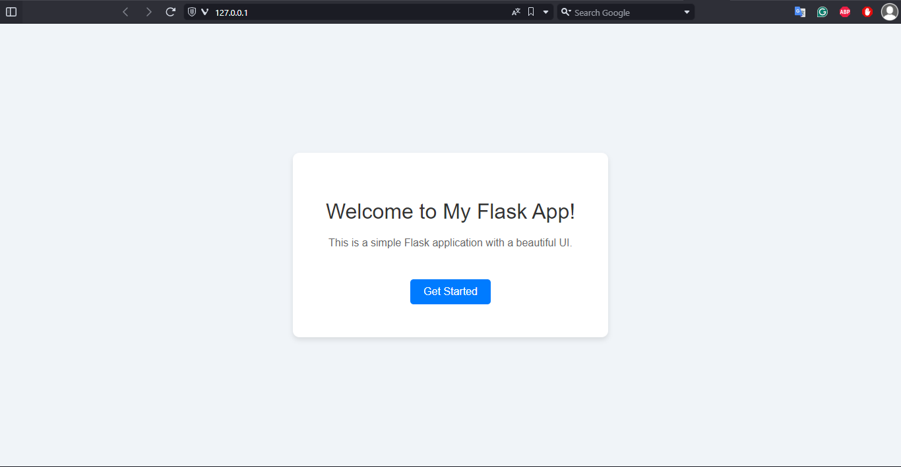
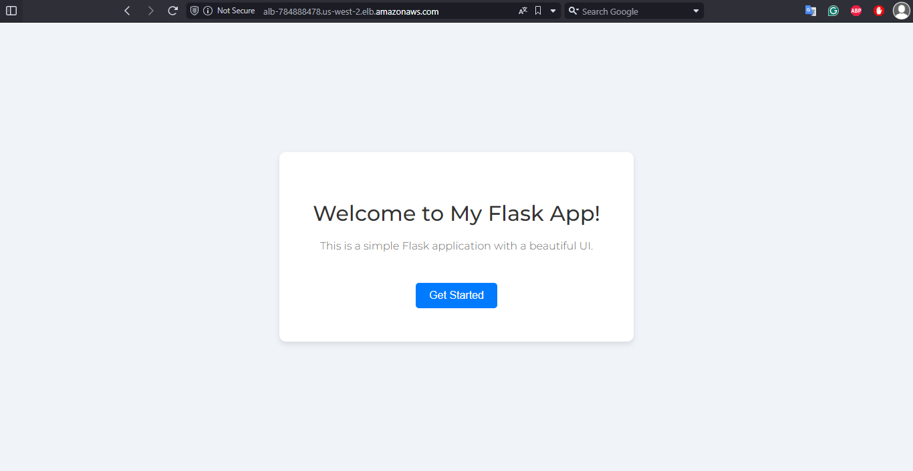

# Flask App Deployment on AWS

This project demonstrates how to deploy a flask app on AWS using Terraform for infrastructure management, Docker for containerization, and GitHub Actions for deploy the infrastructure.

## Overview

Deploy an flask app within a private subnet, ensuring secure access through an Application Load Balancer (ALB) and a NAT gateway. The flask app will display simple UI upon access.

## Prerequisites

- **AWS Account**: A free tier account is sufficient.
- **Terraform**: Must be installed. [Installation Guide](https://learn.hashicorp.com/tutorials/terraform/install-cli)
- **Docker**: Should be installed on your local machine for image testing. (optional)
- **Environment Variables**: Set the following:
  - `TF_VAR_AWS_ACCESS_KEY`: Your AWS access key.
  - `TF_VAR_AWS_SECRET_ACCESS_KEY`: Your AWS secret key.

## Steps to Deploy the Infrastructure

### AWS Infrastructure main Resources

1. **Virtual Private Cloud (VPC)**

2. **2 Public subnets (High Availability)**

3. **Private subnet**

4. **EC2 Instance (custom flask app deployed in the private subnet)**

5. **Security Groups**
   - Configured security groups for the VPC, ALB, and the flask app instance.

6. **NAT Gateway with EIP**

7. **Application Load Balancer (ALB)**
   - ensuring high availability across the two public subnets.

### Infrastructure Deployment with Terraform
1. **Cloning the repo and cd to Infrastructure directory**
2. **Initialize Terraform**
   - Run `terraform init` to initialize the Terraform working directory.
3. **Plan the Deployment** (optional)
   - Run `terraform plan` to review the deployment plan.
4. **Apply the Deployment**
   - Run `terraform apply` to deploy the infrastructure.
5. **Access flask app**
   - Access the flask app trough the browser via the ALB URL, which is output after applying the terraform apply command.
6. **Destroy the Infrastructure**
    - Run `terraform destroy` to tear down the infrastructure.

## Docker Containerization - Explanation
1. **Dockerfile Creation**
   - I created a Dockerfile for the flask application.
2. **I Built Docker Image**
   - I ran `docker build -t almogmaman762/simple-flask .` in the application directory to build the image.
3. **Local Testing**
   - I tested the Docker image locally by running it `docker run -p 80:80 almogmaman762/simple-flask`.
4. **Docker Hub Login**
   - Logged to Docker Hub using `docker login` with my docker Hub credentials.
5. **Pushed Docker Image**
   - I pushed the flask app image to my Docker Hub account.

## Local Access

## Public Access

- The flask app will be accessible via the browser.
- The instance is deployed in a private subnet and is accessed through the ALB that load balance from 2 public subnets (High Availability).

## GitHub Workflows

1. **Deployment Workflow**
   - Triggered on changes to the main branch with specific commit. 
   - Builds the infrastructure and deploys the application.
   - Can be manually triggered.

2. **Destraction Workflow**
   - destroy the infrastructure when commiting a specific commit message to main branch.
   - Can be manually triggered.

3. **Workflow Authentication**
   - Uses GitHub repository secrets for authentication.

## Authentication

- Preferred method: Environment variables to streamline the GitHub Actions deployment process.
- And make the deployment a bit faster :) (no need to install AWS CLI)

## Terraform Usage
1. **Initialization**
   - `terraform init` to download relevant providers/modules.
2. **Validation**
   - `terraform validate` to check the code.
3. **Planning**
   - `terraform plan` for a dry run.
4. **Application**
   - `terraform apply` to deploy the infrastructure.
   - Optional: Use `--auto-approve` for non-interactive execution.
5. **Destruction**
   - `terraform destroy` to tear down the infrastructure.
   - Optional: Use `--auto-approve` for non-interactive execution.

**Note**
 - my project uses remote terraform backend - Amazon S3.